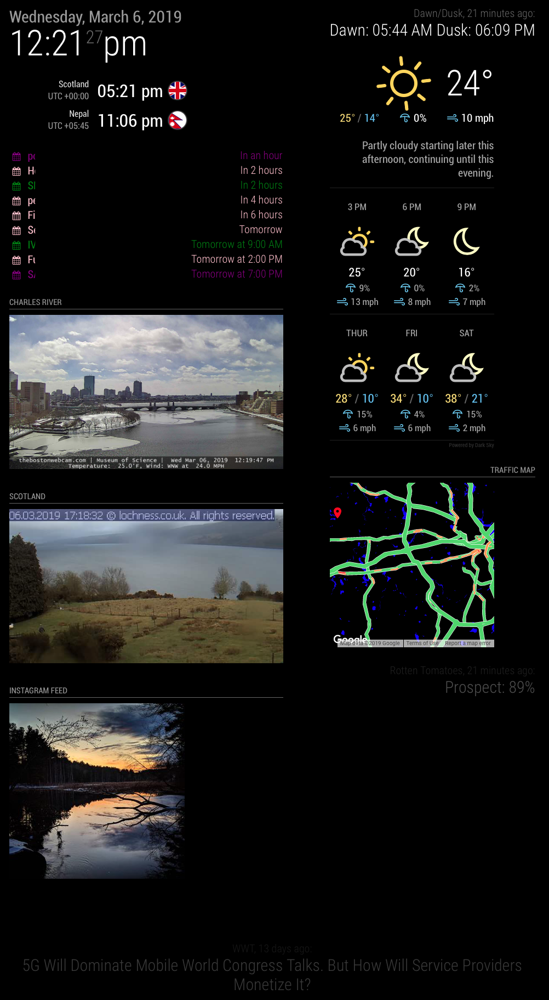

# MagicMirror
My files for a large monitor Magic Mirror project. This all started when the outdoor thermometer in my bedroom broke. I thought "I can make my own weather station from an old Raspberry Pi!" I started with www.dakboard.com (very nice) and then moved on to https://github.com/MichMich/MagicMirror (very customizable). Additional Magic Mirror modules can be found here: https://github.com/MichMich/MagicMirror/wiki/3rd-party-modules. Once I had the Pi Mirror running, I grabbed an old, unused monitor and made a larger display to display a few more modules like our family Google Calendar, latest DVD rankings on Rotten Tomatoes, a few time zones that family members are in, dusk/dawn times for our chicken coop automatic door.

Description of files: 
<ul>
<li>config.js: This is the file that you edit to define the layout of your screen. The page for each module describes the variables that can be used for that module. Make sure you match your curly braces. Sometimes it is easier to duplicate another module in config.js and edit from there. I randomized all API keys in this file. You can grab your personal API keys at the corresponding data provider.</li>
<li>crontab.txt: The output of crontab -l on my Linux web server that is grabbing web content, creating dawn/dusk and Rotten Tomatoes RSS feeds and placing them in the Linux web server for Magic Mirror to grab.</li>
<li>create_tom_rss.sh: Very ugly bash commands to curl rottentomatoes.com/browse/top-dvd-streaming/ and format the results into something resembling a RSS feed.</li>
<li>dawn_dusk.sh: Another very ugly bash commands to lynx -dump gaisma.com and format the Dawn/Dusk values as an RSS feed.</li>
</ul>

